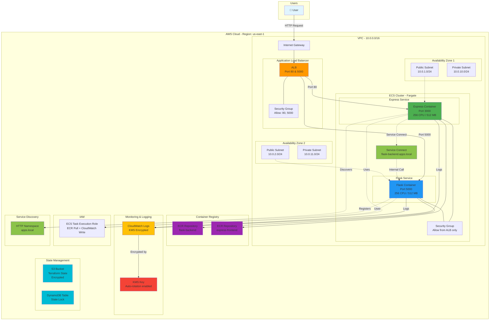
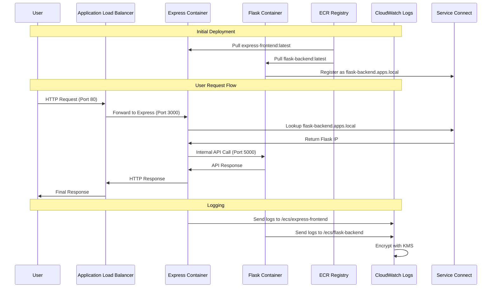
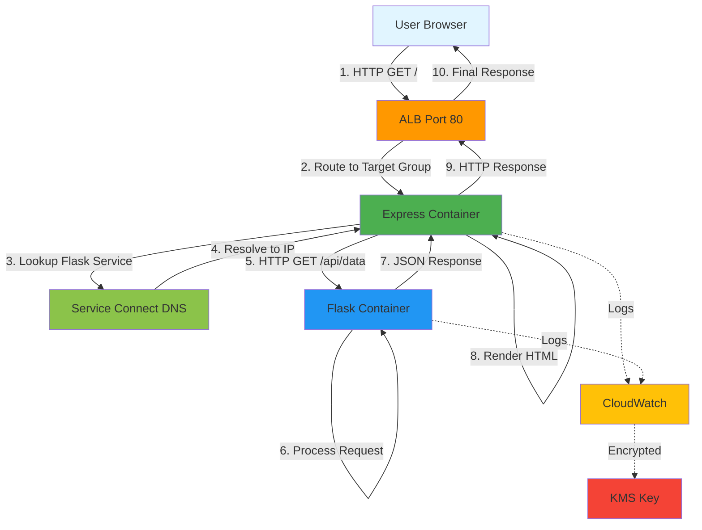
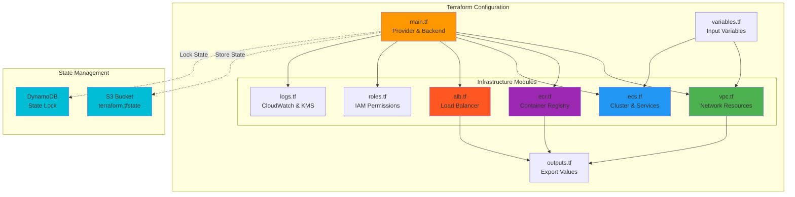
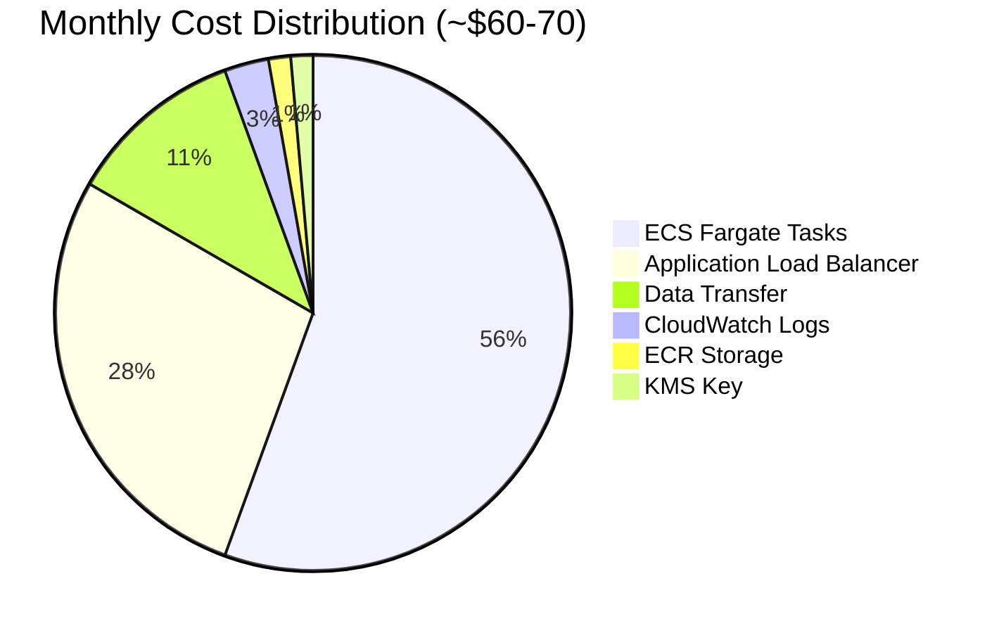
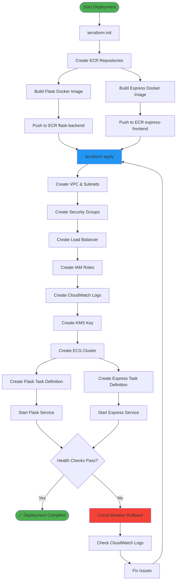

# Architecture Diagram

## System Architecture



## Detailed Component Flow



## Network Security Flow

```mermaid
graph LR
    subgraph "Internet"
        Internet[🌐 Internet]
    end
    
    subgraph "Security Layers"
        SG1[ALB Security Group<br/>✅ Allow 80, 5000 from 0.0.0.0/0<br/>✅ Allow all outbound]
        SG2[ECS Security Group<br/>✅ Allow 3000, 5000 from ALB SG<br/>✅ Allow 5000 from self<br/>✅ Allow all outbound]
    end
    
    subgraph "Resources"
        ALB2[Application Load Balancer]
        ECS[ECS Tasks]
    end
    
    Internet -->|HTTP 80, 5000| SG1
    SG1 --> ALB2
    ALB2 -->|Filtered| SG2
    SG2 --> ECS
    ECS -.->|Inter-service| SG2

    style SG1 fill:#4caf50
    style SG2 fill:#2196f3
    style Internet fill:#ff9800
```

## Data Flow Diagram



## Infrastructure as Code Structure



## Cost Breakdown



## Deployment Flow



---

## How to View These Diagrams

### Option 1: GitHub (Recommended)
Upload this file to GitHub - Mermaid diagrams render automatically.

### Option 2: VS Code
Install the "Markdown Preview Mermaid Support" extension.

### Option 3: Online Viewers
- [Mermaid Live Editor](https://mermaid.live/)
- Copy and paste the code blocks

### Option 4: Export as Images
Use the Mermaid CLI to generate PNG/SVG:
```bash
npm install -g @mermaid-js/mermaid-cli
mmdc -i ARCHITECTURE.md -o architecture.png
```

## Architecture Highlights

### 🔒 Security
- Multi-layer security groups
- KMS encryption for logs
- No public IPs for containers (uses ALB)
- IAM roles with least privilege

### 🚀 High Availability
- Multi-AZ deployment
- Auto-scaling capable
- Health checks with circuit breaker
- Load balancing across zones

### 📊 Observability
- CloudWatch Logs integration
- Container Insights enabled
- Centralized logging
- Encrypted log storage

### 💰 Cost Optimization
- Fargate (pay per use)
- 1-day log retention
- Right-sized containers (256 CPU)
- No NAT Gateway (uses public subnets)

### 🔄 Service Communication
- Service Connect for discovery
- No hardcoded IPs
- Automatic DNS resolution
- Internal service mesh
